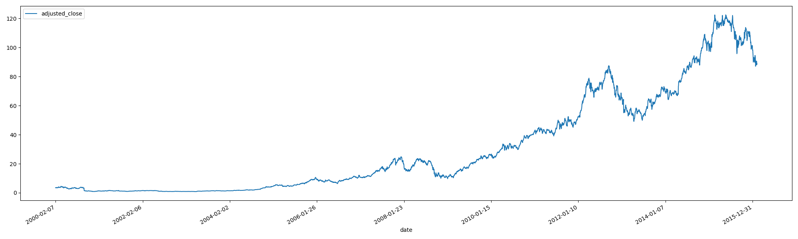
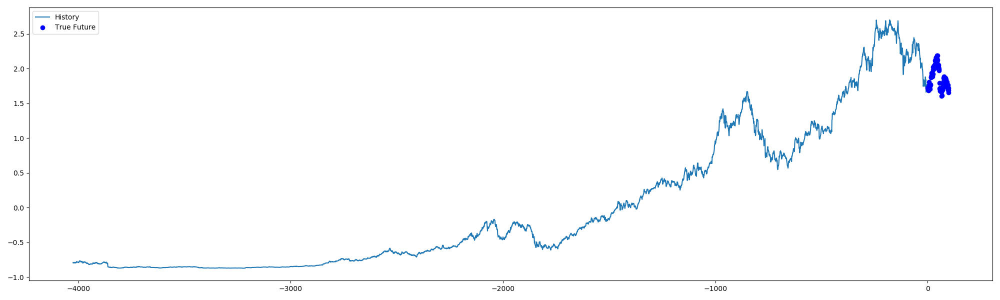
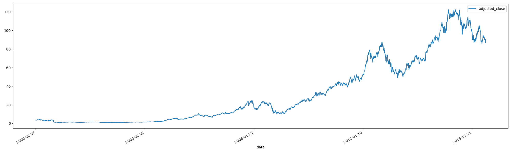

# investing-tensorflow-sandbox

Supports only local runs at this time, mostly as an exploratory venture into Recurrent Neural Networks to do 
multivariate time-series forecasting on stock prices.

## To run this locally, you will need

- tensorflow==2.1.0
- Nvidia CUDA-enabled graphics acceleration (e.g. RTX 2060)
- Nvidia drivers
- Nvidia CUDA 10.1 (no higher)
- Nvidia cudnn 10.1

1. Clone this repo
2. Install everything listed above
3. `pip install -r requirements.txt`
4. If you want to run the "production" version which hits AlphaVantage for historical stock data, visit
[their website](https://www.alphavantage.co/support/#api-key) to claim your own and write it into
`src/main/resources/properties_local.yml`
    - if you do this, then for step 6 you want to use `--env prd` instead of `local`
5. Create your local properties yml file by copying `properties_local.yml` into the same directory but changing the name
to `properties.yml` - this file is gitignored
6. Edit `src/main/start.py` Run Configuration to run with parameters `--env local`
    - alternatively, run `python3 src/main/start.py --env local`

## Details

The script is written with generalization in mind, and so there is API integration with AlphaVantage, which offers
this application the capability to be run for any stock symbol. Nothing is hardcoded.

However, understandably most would not want to go to the trouble of generating an API key so I have provided a local
configuration to run for just **AAPL**.

## Example Output

*Disclaimer: I was not able to get the RNN model to start training - I ran into a dimensionality error which I'm not
currently qualified or equipped to debug and figure out at this point, but there is still reproducible training
prediction modeling output you can get.

The following is for AAPL, using the first 4000 close prices to estimate the next 100. Prices are adjusted for splits.

### First 4000 days of trading

### 100 day future predictive modelling

### Actual 4100 days of trading

